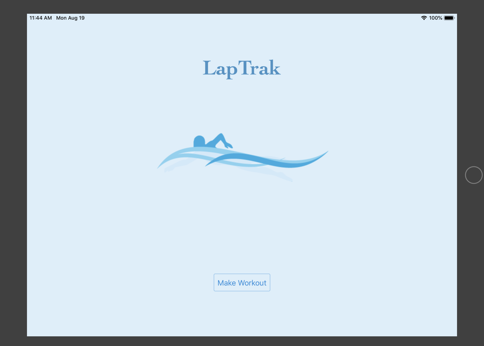
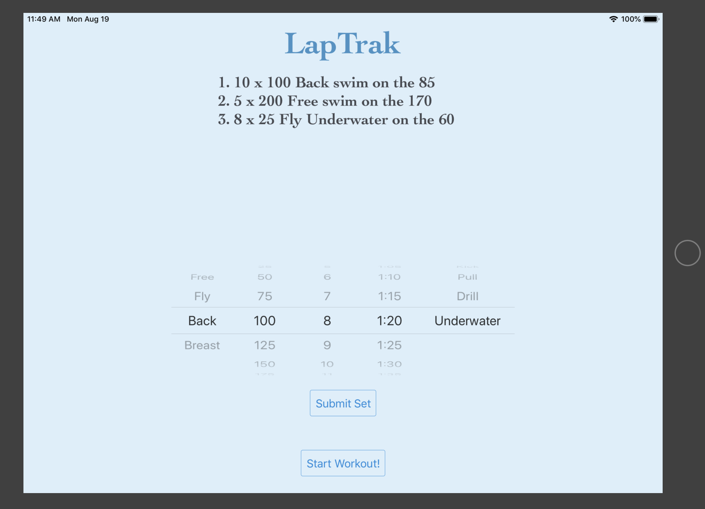
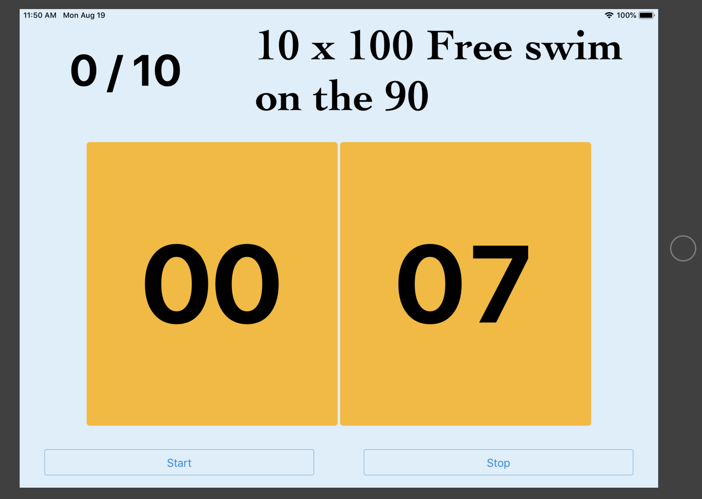
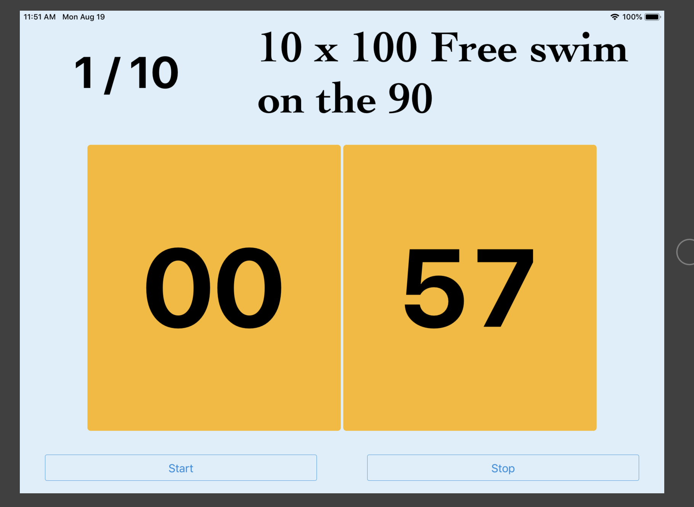
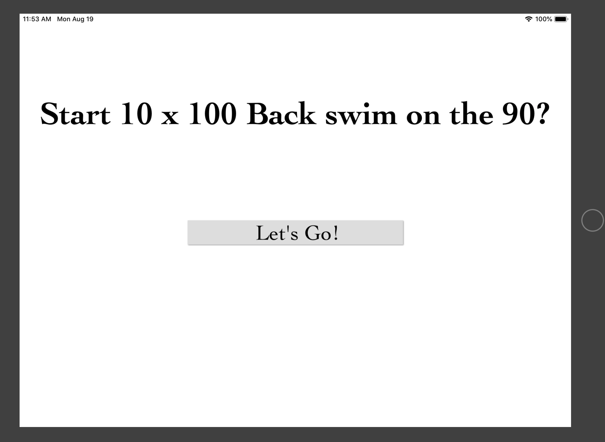

# LapTrak

Purpose: Coming from the world of competitive swimming there is one consistent problem which is that as you swim longer sets with more reps and longer yardage, you will inevitably face the problem of remembering where you are in a set or where you are in your current rep. For example, college we were told to do a set of 100 x 100 yard free, which is 10,000 yards. Other than the fact that the workout was a nightmare, no one could remember how many they had done so in reality we probably did 100-ish 100s. When faced with doing longer individual reps, such as 5 x 500 yard free, the problem exists inside of the rep, "Have I swam 300 or 350 yards?" You come to the wall, look at the clock and realize you either swam a 50 too far or too little. Current competitive swim training relies on interval training to better swimmers so missing entire reps or finishing a rep early because you skipped a 50 can be detrimental to the success of the practice which can impact your ability to compete as well. 

Solution: To address this problem I created an iPad app and also an iPad case which houses the iPad and allows it to sit nicely at the bottom of the pool called LapTrak. The premise is relatively simple, preload the iPad with the workouts for the day, put the iPad in the protective case, hit go, and put it on the bottom of the pool. 

### Home Screen

### Build Your WorkOut
  

### Start Your WorkOut
The will provide you with 10 seconds to posistion the iPad on the bottom of the pool. 
  

  ### Workout Mode Set
The app tracks current time in yellow to let you know how much time is left in the rep 
but the app also tells you in the upper left corner how many reps you have left in the set. 
  

### Next Set
Take your time between sets and start when you're ready. 
  

